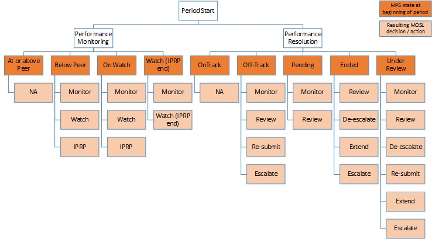

```{r message = FALSE, echo = FALSE, error = FALSE, warning = FALSE, child = "pfm_report_mps_section.Rmd", eval = nrow(mps_data_clean_temp) > 0}

```

\newpage

```{r message = FALSE, echo = FALSE, error = FALSE, warning = FALSE, child = "pfm_report_ops_section.Rmd", eval = nrow(ops_data_clean_temp) > 0}

```

\newpage

```{r message = FALSE, echo = FALSE, error = FALSE, warning = FALSE, child = "pfm_report_api_section.Rmd", eval = nrow(api_data_clean_temp) > 0}

```

\newpage

# Appendix

`r if (include.full.ranking) { paste0("## Full MPS Performance ranking") }`

```{r message = FALSE, echo = FALSE, error = FALSE, warning = FALSE, fig.width = 12, fig.height = 8, eval = include.full.ranking}

tryCatch(
  expr = {
  mps_aggregate_perf %>%
    dplyr::filter(
      tp_type == as.character(mps_aggregate_perf_temp$tp_type),
      Period == data.period
      ) %>%
    ggplot2::ggplot() +
    ggplot2::geom_bar(
      ggplot2::aes(
        x = reorder(ShortName, Agg_Perf_roll), 
        y = Agg_Perf_roll,
        fill = dplyr::if_else(Trading.Party.ID == TRADING.PARTY, "highlight", "normal")
        ), 
      stat = "identity",
      show.legend = FALSE) +
    ggplot2::scale_y_continuous(labels = scales::percent_format(accuracy = 1)) +
    ggplot2::scale_fill_manual(values = c("#425563", "azure3")) +
    ggplot2::coord_flip() +
    ggplot2::theme_bw() +
    ggplot2::theme(text = ggplot2::element_text(size = 15)) +
    ggplot2::labs(
      title = "Ranking of Overall MPS Performance",
      subtitle = paste0("Rolling 6-month mean of aggregate MPS performance by Trading Party (", mps_aggregate_perf_temp$tp_type, "s)"),
      caption = "Source: MOSL", x = "", y = ""
      )
  }, 
  error = function(e){}
)

```

`r if (include.full.ranking & nrow(ops_data_clean_temp) > 0) { paste("## Full OPS Performance ranking") }`

```{r message = FALSE, echo = FALSE, error = FALSE, warning = FALSE, fig.width = 12, fig.height = 8, eval = (include.full.ranking & nrow(ops_data_clean_temp) > 0)}

tryCatch(
  expr = {
  ops_aggregate_perf %>%
    dplyr::filter(
      Period == data.period,
      PerformanceMeasure == "Completed"
      ) %>%
    ggplot2::ggplot() +
    ggplot2::geom_bar(
      ggplot2::aes(
        x = reorder(ShortName, Agg_Perf_roll), 
        y = Agg_Perf_roll,
        fill = dplyr::if_else(Trading.Party.ID == TRADING.PARTY, "highlight", "normal")
        ), 
      stat = "identity",
      show.legend = FALSE) +
    ggplot2::scale_y_continuous(labels = scales::percent_format(accuracy = 1)) +
    ggplot2::scale_fill_manual(values = c("#425563", "azure3")) +
    ggplot2::coord_flip() +
    ggplot2::theme_bw() + 
    ggplot2::theme(
      text = ggplot2::element_text(size = 15)
      ) +
    ggplot2::labs(
      title = "Ranking of Overall OPS Performance (Completed)",
      subtitle = 
        paste0(
          "Rolling 6-month mean of aggregate OPS performance by Trading Party"),
      caption = "Source: MOSL"
      ) +
    ggplot2::ylab("") + ggplot2::xlab("")
  }, 
  error = function(e){}
)

```

```{r message = FALSE, echo = FALSE, error = FALSE, warning = FALSE, fig.width = 12, fig.height = 8, eval = (include.full.ranking & nrow(ops_data_clean_temp) > 0)}

tryCatch(
  expr = {
  ops_aggregate_perf %>%
    dplyr::filter(
      Period == data.period,
      PerformanceMeasure == "Outstanding"
      ) %>%
    ggplot2::ggplot() +
    ggplot2::geom_bar(
      ggplot2::aes(
        x = reorder(ShortName, Agg_Perf_roll), 
        y = Agg_Perf_roll,
        fill = dplyr::if_else(Trading.Party.ID == TRADING.PARTY, "highlight", "normal")
        ), 
      stat = "identity",
      show.legend = FALSE) +
    ggplot2::scale_y_continuous(labels = scales::percent_format(accuracy = 1)) +
    ggplot2::scale_fill_manual(values = c("#425563", "azure3")) +
    ggplot2::coord_flip() +
    ggplot2::theme_bw() + 
    ggplot2::theme(
      text = ggplot2::element_text(size = 15)
      ) +
    ggplot2::labs(
      title = "Ranking of Overall OPS Performance (Outstanding)",
      subtitle = "Rolling 6-month mean of aggregate OPS performance by Trading Party",
      caption = "Source: MOSL"
      ) +
    ggplot2::ylab("") + ggplot2::xlab("")
  }, 
  error = function(e){}
)

```

## Performance Criteria

### Market Performance Standards (MPS)

```{r, message = FALSE, echo = FALSE, error = FALSE, warning = FALSE}

MPS_IPRP_LIST <- Standards_details %>%
  dplyr::filter(StandardKey == "MPS", IPRPeligible, Standard != "MPS 18") %>%
  dplyr::pull(Standard)

OPS_IPRP_LIST <- Standards_details %>%
  dplyr::filter(StandardKey == "OPS", IPRPeligible) %>%
  dplyr::pull(Standard)

```

A Trading Party's performance will be flagged when the ratio of on-time task completion to total tasks completed for that MPS falls below the peer mean level for three consecutive months. "Peer mean" refers to the mean of all on-time task ratios for every Trading Party in the market. 

The following MPS are currently subject to this criterion: `r paste(MPS_IPRP_LIST, collapse = ", ")`.

MPS performance will also be flagged when it is lower than the threshold percentage, set by MOSL. Note that this threshold can change. The following MPS are currently subject to this criterion: MPS 18.

A Trading Party’s performance may also be flagged if performance falls below the peer mean level or threshold level for any three months out of the latest six month period.

### Operational Performance Standards (OPS)

Performance is flagged when the following measures fall below a threshold for three consecutive months:

* Key Performance Indicator (KPI): ratio of on-time task completion to total tasks completed
* Additional Performance Indicator (API): ratio of tasks outstanding in time to total tasks outstanding)

Currently, the thresholds are 85% for the KPI and 75% for the API. for the following OPS: `r paste(OPS_IPRP_LIST, collapse = ", ")`.

A Trading Party’s performance may also be flagged if performance falls below the threshold level for any three months out of the latest six month period.

## Evaluation of Performance

When evaluating performance flags, MOSL takes into account other factors, including: 

* Performance relative to comparable peers
* Number of tasks relative to size
* Other important Trading Party activities (e.g.  data improvement activity and significant operational changes)

Persistently poor performance could lead to the issue being escalated to MOSL's Performance Resolution process through an Initial Performance Rectification Plan (IPRP). Failure to improve over time at this stage could lead to the issue being further escalated to a Performance Rectification Plan (PRP) overseen by the MPC.

## Categorisation and MOSL Actions

The categorisation of a performance standard or Additional Performance Indicator (API) in each period is determined by the following:

* Whether an IPRP or PRP has been initiated
* Performance in the previous period
* MOSL actions in the previous period

MPS data is processed after the 10th business day of each month and marks the beginning of the period for MPS. 

```{r pressure, echo = FALSE, fig.cap = "Diagram of possible states and corresponding MOSL actions", out.width = '100%'}



```
